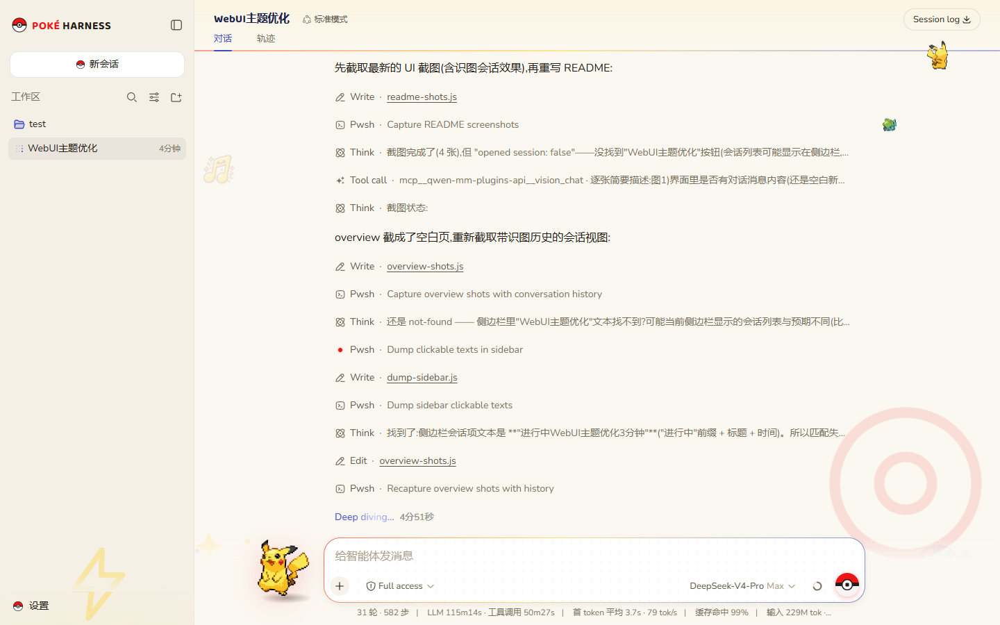
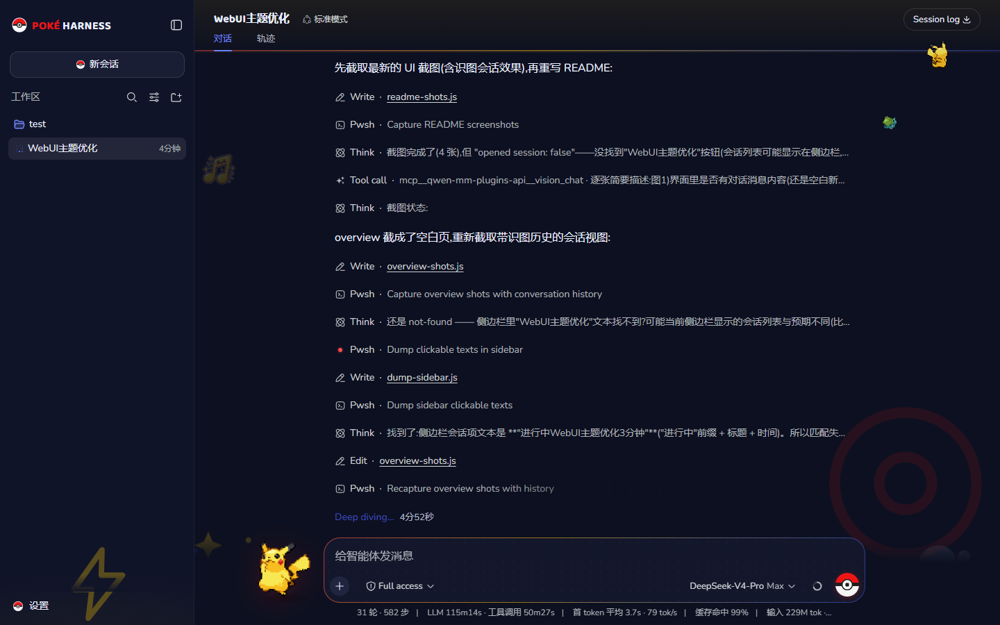
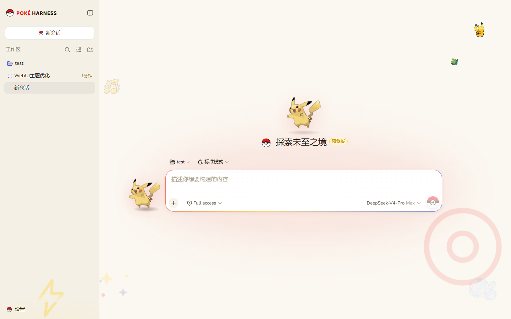
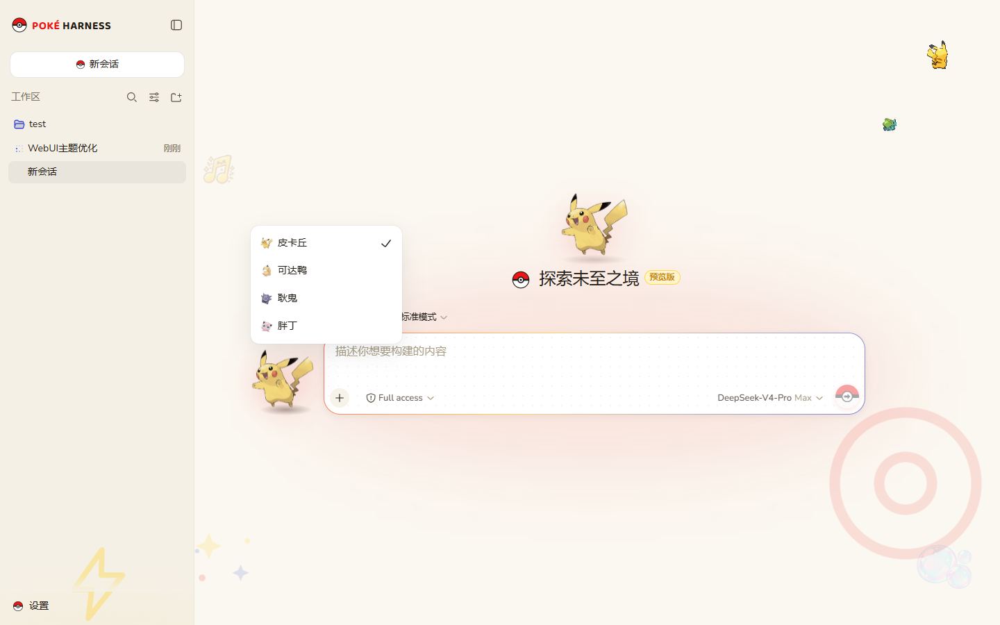

# my-deepseek-harness

> 本仓库是官方 [deepseek-ai/deepseek-harness](https://github.com/deepseek-ai/deepseek-harness) 的**个性化定制仓库**,在官方基础上增加了两套能力:
> **① 宠物小精灵(Pokémon)主题 Web UI;② 基于 Qwen-MM 的图片识别管线。**
>
> 官方核心功能与代码保持原样,定制部分集中在少数包内(见下文改动地图),并以分支方式管理,便于跟随官方升级与回滚。

---

## 界面预览

**亮色主题(会话视图,消息流中可见工具调用行与装饰元素)**



**暗色主题**



**欢迎页(皮卡丘 + 渐变输入框 + 输入框旁的小精灵伴侣)**



**宠物伴侣切换(皮卡丘 / 可达鸭 / 耿鬼 / 胖丁,输入中与输出中自动切换姿势)**



---

## 一、Pokémon 主题定制清单

| 类别 | 内容 |
| --- | --- |
| 配色令牌 | 精灵球红 `#EE1515` / 宝可梦蓝 `#3B4CCA` / 皮卡丘黄 `#FFCB05`,亮暗双主题 |
| 字体 | 内置 Nunito(正文)+ Baloo 2(标题/品牌)可变字体,中文回退系统字体 |
| 品牌 | 精灵球图标、`POKÉ HARNESS` 词标、精灵球 favicon 与标题栏主题色 |
| 宠物伴侣 | 输入框左侧小精灵(4 只可切换),待机/输入中(背影像素)/输出中(战斗动画)三姿态 |
| 输入区 | 红→黄→蓝渐变描边 + 波点纹理输入卡片、精灵球发送/停止按钮 |
| 背景与挂件 | 两侧精灵球线稿/星尘/音符/泡泡贴纸(部分由 gpt-image-2 生成)、侧边栏闪电水印 |
| 对话细节 | 红色渐变用户气泡、引用块红边卡片、缎带分割线、面板渐变背景、会话标题展示字体 |
| 加载页 | 随机小精灵迎接 + 旋转精灵球 spinner |
| 设置 | 「外观」中新增 **Poké 装饰开关**(一键关闭全部挂件/水印/光晕) |

## 二、图片识别管线(Qwen-MM)

纯文本主力模型(deepseek-v4-pro)现在**可以直接接收图片消息**:

```
用户拖图发送
  → 图片落盘本地暂存目录(消息立即显示,不阻塞)
  → 消息双轨:展示层 = 原话 + 图片缩略图;模型层 = 图片路径 + 分析指令
  → agent 调用专用 `analyze_image` 工具(Qwen VL,qwen3.7-plus)
     一次调用分析全部图片 · 关闭思考模式 · max_tokens 800
  → 精简描述结合用户输入 → 主力模型回复
```

**实测性能**:单批分析约 **1.5–2 秒 / 270 tokens**(对比默认思考模式约 10 秒 / 1450 tokens);多图一次调用,参数无歧义。

**空间管理**:同会话新图自动替换旧暂存;会话归档时自动清理;插件启动时清理 24h 以上孤儿目录。

**视觉凭据**:`~/.qwen-mm-plugins/config`(`DASHSCOPE_API_KEY` / `DASHSCOPE_BASE_URL`,支持 Token Plan / DashScope / 自建 OpenAI 兼容端点)。

## 三、仓库结构

| 分支 | 用途 |
| --- | --- |
| `master` | 与官方 `upstream/master` 同步的**纯净基线**(无任何定制) |
| `pokemon-theme` | 全部定制改动(2 个逻辑 commit:主题 + 识图管线) |

远程:`upstream` = 官方仓库 · `origin` = 本仓库。

**改动地图**(升级冲突时对照):

| 位置 | 内容 |
| --- | --- |
| `packages/client/ui-theme` | 配色令牌、字体、装饰层、装饰开关 |
| `packages/client/web` | 加载页、装饰层挂载 |
| `packages/client/ui-primitives` | 精灵球图标、品牌词标、markdown 排版 |
| `packages/client/ui-sidebar` / `ui-conversation` / `ui-settings-general` | 宠物伴侣、输入卡片、面板/标题/按钮样式 |
| `apps/web` | favicon、标题、字体与素材、装饰层 DOM |
| `packages/host/image-input` | **独立插件**:图片暂存、`analyze_image` 工具、生命周期清理 |
| `packages/host/apiproxy` | 可选的 `imagePromptPreprocessor` 服务 hook |
| `packages/llm/*` | `UserMessage.modelContent` 模型投影(展示/模型内容分离) |

**用户级配置**(不在 git 内,升级零影响):`~/.dsh/profiles/web/cordis.patch.yml`(插件注册)、`~/.dsh/skills/qwen-mm-plugins-api`、`~/.qwen-mm-plugins/config`、`D:\WorkSpace\RunApp\qwen-mm`(uv venv)。

## 四、构建与运行

```powershell
pnpm install                                  # 链接工作区包
npm run build:lib:host                        # host 产物(含识图管线)
npm run build:lib:client                      # client 产物(含主题 UI)
pnpm --filter @deepseek-ai/dsh-web-frontend run build   # web dist
.\dsh-web.ps1 start                           # 启停脚本(带失败自动降级容错,见使用说明)
```

运行依赖:Node.js ≥ 22、pnpm、`~/.qwen-mm-plugins/config` 中的视觉 API key(仅识图需要)。

## 五、升级、合并与回滚

详细步骤见 `D:\WorkSpace\RunApp\deepseek-harness升级合并指南.md` 与 `D:\WorkSpace\RunApp\dsh-web使用说明.md`。

快速流程:

```powershell
git checkout master
git fetch upstream
git merge --ff-only upstream/master && git push
git checkout pokemon-theme
git merge master                    # 冲突集中在"改动地图"列出的 6 个包
# 重新构建(见上)后重启
```

回滚:`git revert <commit>` 或 `git checkout master`。

---

## 致谢

- [deepseek-ai/deepseek-harness](https://github.com/deepseek-ai/deepseek-harness) — 官方框架,本仓库全部核心能力来源
- [QwenLM/Qwen-MM-Plugins](https://github.com/QwenLM/Qwen-MM-Plugins) — 多模态能力(Skill + MCP)
- [PokeAPI/sprites](https://github.com/PokeAPI/sprites) — 精灵图素材(版权归 Pokémon Company / Nintendo,仅供个人使用)
